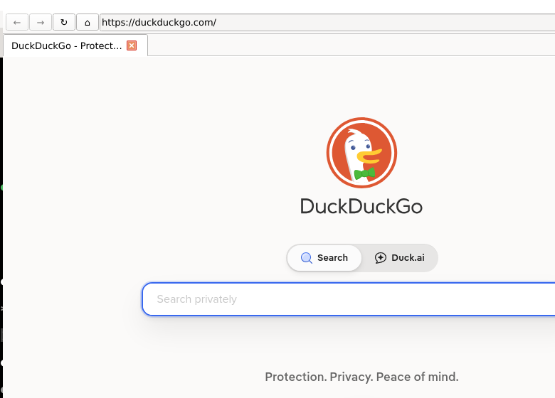

# BagusBagusGo (BBGo)

**Versão: 2.1.0**  
Browser desktop construído com Python 3 e PySide6 (QtWebEngine).  
Motor de busca padrão: **DuckDuckGo** · Tema: **Dark + Vermelho**.

**Repositório:** https://github.com/eueocraudio/bagusbagusgo



---

## Requisitos

- Python 3.10 ou superior
- PySide6 com QtWebEngine e QtWebChannel

---

## Instalação

```bash
bash install.sh
```

Ou manualmente:

```bash
pip3 install --break-system-packages PySide6
```

---

## Iniciando

```bash
# Diretório temporário em /tmp/ (gerado automaticamente)
python3 run.py

# Diretório específico para dados persistentes
python3 run.py /caminho/do/diretorio
```

A janela abre **maximizada**. O caminho do diretório de dados é impresso no terminal:
```
[BBGo v2.1.0] diretório de dados: /tmp/bagusbagusgo_abc123
```

---

## Tutorial

### 1. Navegar para um site

Digite na barra de endereço e pressione **Enter**:

- URL com domínio → abre diretamente: `python.org`, `https://github.com`
- Texto com espaços → pesquisa no DuckDuckGo: `como instalar python no linux`

---

### 2. Abas de páginas web

| Ação | Como fazer |
|---|---|
| Abrir nova aba | Botão `+` ou **Ctrl+T** |
| Fechar aba | Botão `✕` na aba ou **Ctrl+W** |
| Trocar de aba | Clique na aba desejada |
| Reordenar abas | Arraste a aba |

Ao fechar uma aba, a página é **destruída** (mídia, JavaScript, timers e rede são encerrados na hora) — vídeo/áudio param imediatamente, inclusive no YouTube.

---

### 3. Navegação

| Ação | Como fazer |
|---|---|
| Voltar | `←` ou **Alt+←** |
| Avançar | `→` ou **Alt+→** |
| Recarregar | `↻` ou **F5** |
| Parar | `✕` (durante carregamento) ou **F5** |
| Página inicial | `⌂` (abre a página inicial; padrão DuckDuckGo, configurável em Settings → Geral) |
| Foco na barra | **Ctrl+L** |

---

### 4. Restauração de sessão

O browser salva automaticamente as URLs abertas ao fechar.  
Na próxima abertura, todas as abas são restauradas.

---

### 5. Favoritos

1. Pressione **Ctrl+D** ou clique em `☆` para favoritar
2. O botão muda para `★` — favorito salvo
3. A **barra de favoritos** aparece abaixo da barra de navegação
4. Clique em qualquer favorito para navegar direto

**Gerenciar** (`★≡`): renomear (duplo-clique) e remover.  
**Remover favorito atual**: **Ctrl+D** novamente.

---

### 6. Histórico

1. **Ctrl+H** ou `🕐` — abre o diálogo
2. Entradas agrupadas por **Hoje**, **Ontem** e datas anteriores
3. Pesquisa em tempo real por título ou URL
4. Duplo-clique para navegar; "Limpar tudo" apaga o histórico

---

### 7. Downloads

1. Clique em qualquer link de download
2. O **painel de downloads** abre automaticamente na parte inferior
3. Progresso, velocidade e tamanho em tempo real
4. Após concluir: **Abrir** (arquivo) ou **Pasta** (`<base_dir>/downloads/`)

Abrir/fechar manualmente: `⬇` ou **Ctrl+J**.

---

### 8. Settings (`⚙`)

Botão na extremidade direita da barra. Menu com:
- **About** — nome, versão e informações do app

A aba **Settings** (topo da janela) tem mais opções, na sub-aba **Geral**:
- **Página inicial / nova aba** — URL aberta em novas abas, no botão `⌂` e ao restaurar sessão vazia (padrão DuckDuckGo). Salva em `.env` como `HOME_URL`; tem efeito na próxima inicialização.

---

### 9. Zoom por página

Ajuste o zoom da página com **Ctrl + scroll do mouse** ou com os atalhos **Ctrl+** / **Ctrl-** / **Ctrl+0** (restaura 100%).

O zoom é **por página (URL)**: cada endereço guarda seu próprio fator em `zoom.json` e ele é **restaurado ao revisitar ou voltar** (back/forward), inclusive em páginas servidas do cache de navegação.

---

### 10. Tema Dark

Interface escura com acentos vermelhos (`src/utils/theme.py`).  
Páginas web também em dark mode via `QWebEngineSettings.ForceDarkMode`.

---

### 11. User Agent aleatório

A cada inicialização, um User Agent é sorteado de `data/user_agents.txt`:

```
[BBGo v2.1.0] user-agent: Mozilla/5.0 (X11; Linux x86_64) ...
```

O `navigator.*`, `plugins`, `mimeTypes` e `window.chrome` são spoofados para mascarar o QtWebEngine.

---

### 12. Pular propagandas no YouTube

Ao acessar qualquer página do YouTube, um script roda a cada 500ms:
- Clica automaticamente no botão "Pular" quando disponível
- Se a propaganda for não pulável, avança o vídeo para o fim

---

### 13. Captura de cliques via Python

Todo elemento clicado tem `tag`, `id` e `name` impressos no terminal:

```
[clique] tag=<a>,  id="logo"
[clique] tag=<input>,  name="q"
```

---

### 14. Injeção de JavaScript por URL

Em `src/main_window.py`, método `_on_load_finished`:

```python
if "site.com" in url:
    view.page().runJavaScript("document.title = 'Meu título';");
```

**Regra ativa:** páginas do Google Tradutor (`translate.google` / `translate.goog`) têm a barra superior removida automaticamente para leitura limpa.

---

## Desempenho e multithreading

O trabalho bloqueante fica fora da thread de UI:

- **Gravações em disco** (favoritos, histórico, sessão, zoom, websettings) são feitas por uma thread dedicada (`utils/async_io.py`), com escrita atômica — a navegação não trava ao salvar.
- **Tarefas de rede** (ex.: botão *Update* de user agents / seletores) rodam sobre um `QThreadPool` (`utils/tasks.py`); a atualização de user agents busca as fontes em paralelo.
- **Chromium** recebe flags de paralelismo (cada site em seu próprio processo, rasterização em threads, downloads paralelos).

Configurável via `.env`:

| Variável | Padrão | Efeito |
|---|---|---|
| `MULTITHREAD_ENABLED` | `true` | Liga as flags de multithreading do Chromium (`site-per-process`, raster threads, `ParallelDownloading`) |
| `CHROMIUM_RASTER_THREADS` | `min(cpu, 4)` | Nº de threads de rasterização do Chromium |

> Em ambientes sem GPU real (VMs, alguns setups Qubes/Wayland) você pode definir `MULTITHREAD_ENABLED=false` se notar instabilidade.

---

## Atalhos

| Atalho | Ação |
|---|---|
| Ctrl+T | Nova aba |
| Ctrl+W | Fechar aba |
| Ctrl+L | Foco na barra de endereço |
| Ctrl+D | Adicionar / remover favorito |
| Ctrl+H | Abrir histórico |
| Ctrl+J | Abrir / fechar painel de downloads |
| Ctrl++ / Ctrl+scroll ↑ | Aumentar zoom da página |
| Ctrl+- / Ctrl+scroll ↓ | Diminuir zoom da página |
| Ctrl+0 | Restaurar zoom (100%) |
| F5 | Recarregar / parar |
| Alt+← | Voltar |
| Alt+→ | Avançar |

---

## Interface — abas externas

| # | Aba | Conteúdo |
|---|---|---|
| 1 | **BagusBagusGo** | Browser completo |
| 2 | **MyAss** | Barra de botões (New work, New flow) + tabela Work/Flow/Status/Date |
| 3 | **AI** | Barra (Agent list) + tabela Agent/Task/Status/Date |
| 4 | **Anonymity** | Placeholder vazio |
| 5 | **AutoBot** | Placeholder vazio |
| 6 | **Downloads** | Placeholder vazio |
| 7 | **Settings** | Painel de configurações (`SettingsPanel`) |

---

## Dados gerados

| Localização | Conteúdo |
|---|---|
| `<base_dir>/bookmarks.json` | Favoritos |
| `<base_dir>/history.json` | Histórico (máx. 5000 entradas) |
| `<base_dir>/session.json` | URLs das abas (restauração) |
| `<base_dir>/zoom.json` | Zoom por página/URL (restaurado ao revisitar/voltar) |
| `<base_dir>/websettings.json` | Overrides de `QWebEngineSettings` (aba Settings → Browser) |
| `<base_dir>/downloads/` | Arquivos baixados |
| `<base_dir>/bagusbagusgo.log` | Log do app (stdout + stderr) |
| `<base_dir>/webengine.log` | Log de conteúdo web (console JS, CORS, etc.) |

---

## Estrutura do projeto

```
run.py                      — entry point; passa sys.argv para main()
data/
  user_agents.txt           — lista de user agents (um por linha)
  ad_selectors.txt          — seletores CSS para bloqueio de anúncios
  extensions/               — extensões Chrome estáticas (ex.: uBlock Origin)
src/
  browser.py                — main(): lê args, aplica flags Chromium, inicia MainWindow
  main_window.py            — MainWindow (orquestra tudo)
  utils/
    constants.py            — APP_NAME, APP_VERSION, APP_ID e constantes globais
    theme.py                — DARK_STYLESHEET (tema dark + vermelho)
    logger.py               — logger do app (bbgo) + logger web (bbgo.web); web_logger()
    tasks.py                — run_async(): executor sobre QThreadPool (resultado volta na thread de UI)
    async_io.py             — writer(): grava JSON fora da thread de UI (coalescing + escrita atômica)
  core/
    browser_tab.py          — BrowserTab (QWebEngineView); Ctrl+scroll zoom via eventFilter no widget de render
    click_capture.py        — captura de cliques via QWebChannel
    session_manager.py      — salva/restaura sessão
    zoom_manager.py         — zoom por página/URL (zoom.json)
    extension_manager.py    — carrega extensões de data/extensions/
    request_interceptor.py  — interceptor HTTP por domínio (extensível)
  privacy/
    user_agent.py           — user agent aleatório + navigator spoof
    ad_blocker.py           — bloqueador CSS baseado em data/ad_selectors.txt
    ads_updater.py          — atualização da lista de seletores
    ua_updater.py           — atualização da lista de user agents
  bookmarks/
    bookmark_manager.py     — CRUD de favoritos em JSON
    bookmarks_dialog.py     — diálogo de favoritos
  history/
    history_manager.py      — registro e busca de histórico
    history_dialog.py       — diálogo de histórico
  downloads/
    download_panel.py       — painel de downloads
  settings/
    env_config.py           — carrega .env; get_bool() / get_str() / get_int()
    settings_panel.py       — SettingsPanel (aba Settings)
    websettings_manager.py  — aplica QWebEngineSettings ao profile
  myass/
    panel.py                — MyAssPanel
  ai/
    panel.py                — AIPanel
install.sh                  — script de instalação
CLAUDE.md                   — instruções para o Claude Code
README.md                   — esta documentação
.gitignore                  — arquivos ignorados pelo git
```
